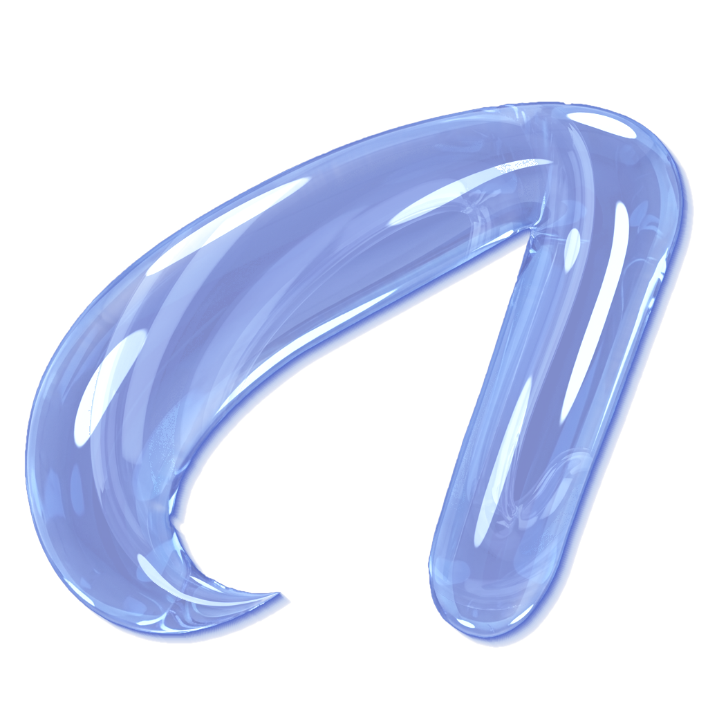
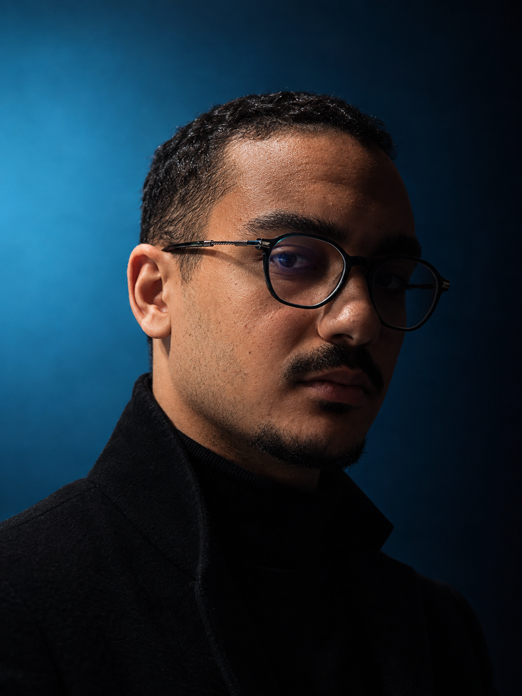
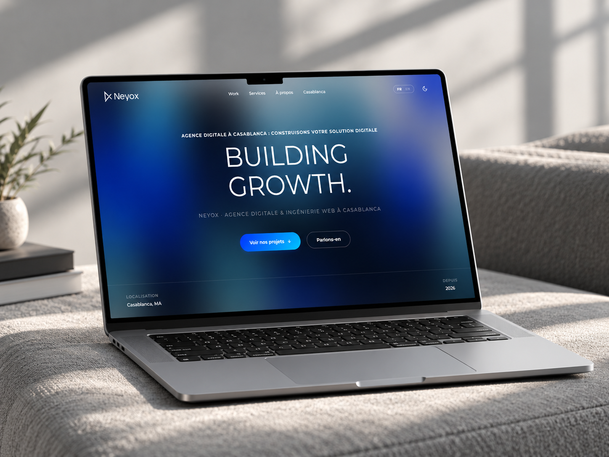
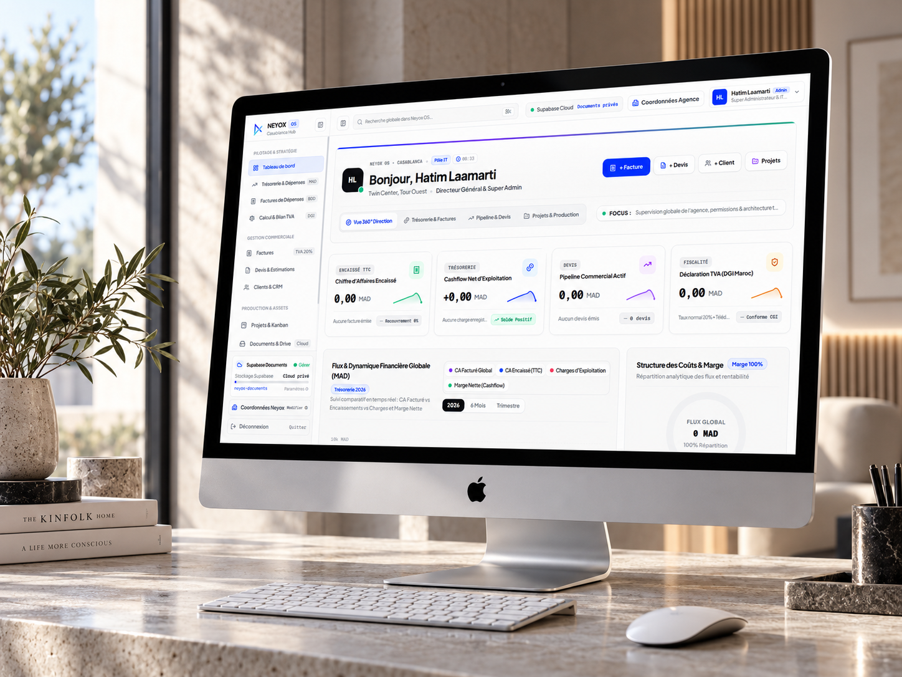
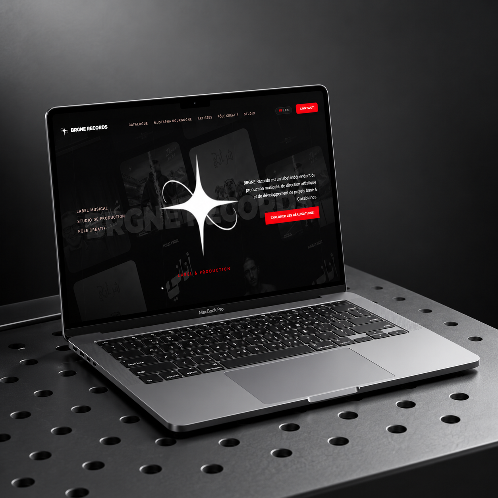
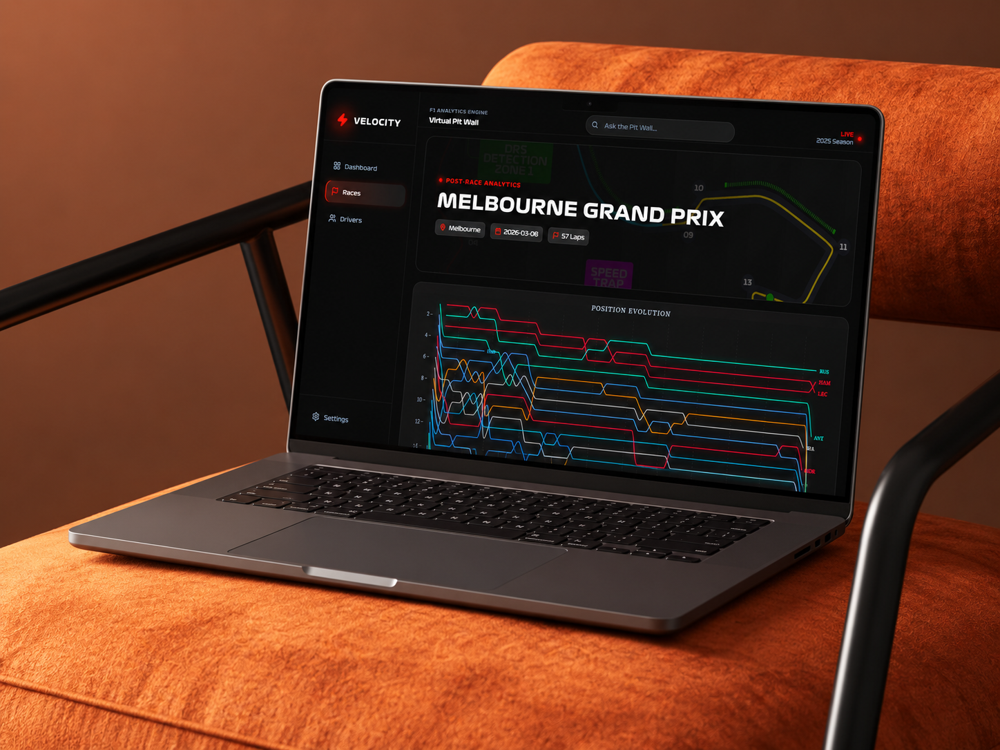
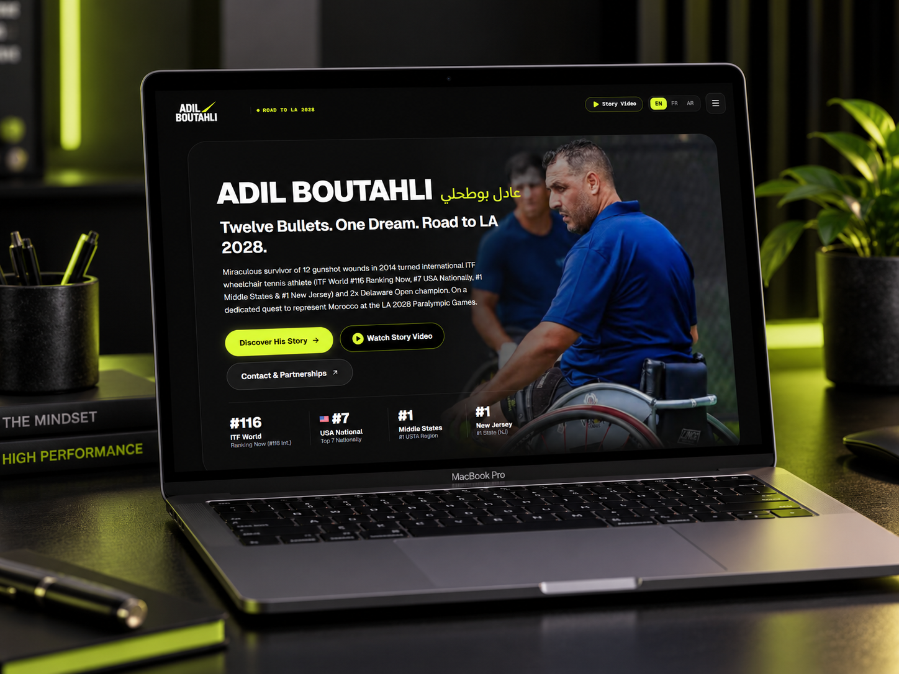

# HATIM LAMARTI

**DESIGN & ENGINEERING**  
Full stack development · AI & data · Casablanca, Morocco

### Ideas. Character. Code.

I design and develop websites, applications and AI tools that turn ideas into experiences people can use.

---

### 00 / THE PERSON BEHIND THE PIXELS

<table>
<tr>
<td width="68%" valign="top">

**Creative in approach. Precise in execution.**

I'm Hatim, a full stack developer and cofounder of [Neyox](https://neyox.ma/). I lead engineering, AI integration and data there. My work connects the design of an interface with the systems that make it work.

Based in Casablanca, I work on brand websites, web applications, internal tools and practical AI integrations. I collaborate directly with clients on design and development, and define the team and scope when Neyox is involved.

**Thinking in systems. Designing with care.**

</td>
<td width="32%" align="center" valign="top">

</td>
</tr>
</table>

### 01 / SELECTED WORK

Seven projects across digital products, sport, music and internal tools. Explore the full context and scope of each project on my [portfolio](https://laamarti.space/).

| Project | Focus | Preview |
| :--- | :--- | :--- |
| **[NEYOX™](https://neyox.ma/)** | Agency platform · Cofounded agency where I lead engineering, AI integration and data |  |
| **FRMR Federation** | Bilingual French / Arabic sports platform · Private rollout |  |
| **Neyox OS** | Internal workspace for projects, customer relationships and workflows · Private access |  |
| **[BRGNE Records](https://brgne.vercel.app/fr)** | Music showcase, discography and interactive audio experience |  |
| **[F1 Velocity](https://f1-velocity-analytics.vercel.app/)** | Formula 1 telemetry application |  |
| **[BDE EFET Hub](https://bdeefet.vercel.app/)** | Student portal |  |
| **[Adil Boutahli](https://adilboutahli.com)** | Athlete platform · Road to LA 2028 |  |

### 02 / WHAT I CAN BUILD

| Websites & interfaces | Applications & platforms | AI & data |
| :--- | :--- | :--- |
| Custom visual identity, navigation and React or Next.js development. | Business interfaces, databases and user journeys built around real workflows. | AI integration, automation and dashboards designed for a clear use case. |

### 03 / TECHNICAL TOOLKIT

**Interfaces**  
      

**Backend & data**  
     

**AI & infrastructure**  
      

### 04 / GITHUB ACTIVITY

### 05 / LET'S MAKE SOMETHING REMARKABLE

Have a project in mind? Send me a few lines about your idea, goals and timeline.

[**Portfolio**](https://laamarti.space/) · [**LinkedIn**](https://www.linkedin.com/in/lamartihatim) · [**GitHub**](https://github.com/hatim3310) · [**Email**](mailto:hatimlamarti3@gmail.com)

Designed with intention. Developed in Casablanca.

