<div align="center">

<!-- Animated Header -->


<!-- Animated Tagline -->
<a href="https://git.io/typing-svg">
   
</a>

<!-- F1 Inspired Animation -->

 
</div>

<!-- Social Links with Hover Effects -->
<br><br>
<a href="https://laamartihatim.vercel.app/">
  
</a>
<a href="https://www.linkedin.com/in/lamartihatim">
  
</a>
<a href="https://www.instagram.com/laamarti_hatim">
  
</a>
<a href="mailto:hatimlamarti3@gmail.com">
  
</a>

<!-- Profile Views & Stars -->
<br><br>


</div>

<!-- About Section with Modern Layout -->
<br>


###  &nbsp;About Me

```javascript
const hatim = {
    location: "🇲🇦 Casablanca, Morocco",
    passions: ["AI/ML", "Web3", "Cloud Architecture", "Formula 1 🏎️"],
    currentFocus: "Building scalable SaaS solutions",
    favoriteF1Team: "Red Bull Racing",
    funFact: "I debug faster than a pit stop! ⏱️",
    motto: "Code like you're on pole position! 🏁"
};
```

<br clear="right"/>
<br>

<!-- F1 Special Section -->
## 🏎️ &nbsp;F1 x Code: My Racing Philosophy

<div align="center">
<table>
  <tr>
    <td align="center" width="25%">
      <br>
      <b>Performance</b><br>
      <sub>Always optimizing</sub>
    </td>
    <td align="center" width="25%">
      <br>
      <b>Quick Fixes</b><br>
      <sub>Fast debugging</sub>
    </td>
    <td align="center" width="25%">
      <br>
      <b>Leadership</b><br>
      <sub>Project excellence</sub>
    </td>
    <td align="center" width="25%">
      <br>
      <b>Ready to Race</b><br>
      <sub>Always prepared</sub>
    </td>
  </tr>
</table>
</div>

<br>

<!-- Experience Timeline -->
##  &nbsp;Journey & Milestones

<div align="center">

```
🏁 ━━━━━━━━━━━━━━━━━━━━━━━━━━━━━━━━━━━━━━━━━━━━━━━━━━━━━━━━━━━ 🏆
         2024                              2025
          |                                 |
    🎓 ALX Certification              🏆 IBM Certified
    AI Career Essentials        Python for AI & Data Science
```

</div>

<br>

<!-- Tech Stack with Grid Layout -->
##  &nbsp;Tech Arsenal (My Racing Setup 🏎️)

<details open>
<summary><b>🎯 Core Technologies (The Power Unit)</b></summary>
<br>

<table>
  <tr>
    <td align="center" width="96">
      
      <br><b>Python</b>
      <br><sub>🏎️ Engine</sub>
    </td>
    <td align="center" width="96">
      
      <br><b>JavaScript</b>
      <br><sub>⚡ Turbo</sub>
    </td>
    <td align="center" width="96">
      
      <br><b>React</b>
      <br><sub>🏁 Front Wing</sub>
    </td>
    <td align="center" width="96">
      
      <br><b>MySQL</b>
      <br><sub>📊 Telemetry</sub>
    </td>
    <td align="center" width="96">
      
      <br><b>Docker</b>
      <br><sub>🔧 Pit Crew</sub>
    </td>
    <td align="center" width="96">
      
      <br><b>Git</b>
      <br><sub>📡 Team Radio</sub>
    </td>
  </tr>
</table>

</details>

<details>
<summary><b>🚀 Full Stack (The Aerodynamics)</b></summary>
<br>


</details>

<details>
<summary><b>🤖 AI & Data Science (The Strategy)</b></summary>
<br>


</details>

<br>

<!-- GitHub Stats with Custom Theme -->
##  &nbsp;Race Statistics 🏁

<div align="center">
  
  
</div>

<div align="center">
  
</div>

<br>

<!-- Activity Graph -->
##  &nbsp;Lap Times (Contribution Activity)


<br>

<!-- Latest Blog Posts -->
##  &nbsp;Latest Blog Posts

<!-- BLOG-POST-LIST:START -->
- 🏎️ [Why Coding is Like F1: Speed, Strategy, and Precision](https://laamartihatim.vercel.app/blog.html)
- 📱 [Building Scalable React Native Apps in 2025](https://laamartihatim.vercel.app/blog.html)
- 🤖 [AI Integration: From Concept to Production](https://laamartihatim.vercel.app/blog.html)
- ⚡ [Performance Optimization: Real-World Case Studies](https://laamartihatim.vercel.app/blog.html)
- 🔐 [Security Best Practices for Modern Web Apps](https://laamartihatim.vercel.app/blog.html)
<!-- BLOG-POST-LIST:END -->

➡️ [**Read more on my blog**](https://laamartihatim.vercel.app/blog.html)

<br>

<!-- Services Section -->
##  &nbsp;Services I Offer

<table>
  <tr>
    <td align="center" width="33%">
      <br>
      <b>Web Development</b><br>
      <sub>Custom websites & web apps<br>React, Next.js, Node.js</sub>
    </td>
    <td align="center" width="33%">
      <br>
      <b>AI Solutions</b><br>
      <sub>ML models & automation<br>Python, TensorFlow</sub>
    </td>
    <td align="center" width="33%">
      <br>
      <b>Mobile Apps</b><br>
      <sub>Cross-platform development<br>React Native</sub>
    </td>
  </tr>
</table>

<br>

<!-- Fun Section -->
##  &nbsp;Developer's Race Strategy

<div align="center">



```mermaid
graph TD
    A[Green Light 🟢] -->|Full Throttle| B[Write Code 💻]
    B --> C{Bug Detected? 🐛}
    C -->|Yellow Flag 🟡| D[Debug Mode]
    C -->|Clear Track ✅| E[Deploy to Production 🚀]
    D -->|Pit Stop ⚡| F[Fix & Refactor]
    F --> B
    E --> G[Checkered Flag 🏁]
    G --> H[Victory Lap! 🏆]
```

### 🏎️ **"It's lights out and away we code!"**

</div>

<br>

<!-- F1 ASCII Art -->
<div align="center">

```
          ______________
        .~      ~. |\___|/
       /         \_|_____\
      /  _   _    \] F1 [/
     /  |o| |o|    \_____/
    <    ___        >   |
     \   \_/       /    |
      \  ____     /    /
       \_______  /____/
         |   |  |
         |___|__|
```

</div>

<br>

<!-- Contact CTA -->
##  &nbsp;Let's Connect!

<div align="center">

### 💼 Open for Freelance Projects • 🤝 Available for Collaboration • 🏎️ Always Ready to Race!

<br>

<a href="https://laamartihatim.vercel.app/">
  
</a>
<a href="mailto:hatimlamarti3@gmail.com">
  
</a>
<a href="https://www.linkedin.com/in/lamartihatim">
  
</a>

<br><br>

### 🏁 Featured Quote

> *"In coding, as in racing, the difference between the ordinary and the extraordinary is that little 'extra'."*

<br>

### 🏎️ Current Lap Time


<br><br>

 &nbsp;**Thanks for visiting! Keep racing, keep coding! 🏁**

</div>

<!-- Footer -->

