```mermaid
graph TD
    A[Coffee ☕] -->|Powers| B[Code 💻]
    B --> C{Bug Found? 🐛}
    C -->|Yes| D[More Coffee ☕]
    C -->|No| E[Deploy 🚀]
    D --> B
    E --> F[Celebrate 🎉]
```

<div align="center">

<!-- Animated Header -->


<!-- Animated Tagline -->
<a href="https://git.io/typing-svg">
   
</a>

 
</div>

<!-- Social Links with Hover Effects -->
<br><br>
<a href="https://laamartihatim.vercel.app/">
  
</a>
<a href="https://www.linkedin.com/in/lamartihatim">
  
</a>
<a href="https://www.instagram.com/laamarti_hatim">
  
</a>
<a href="mailto:hatimlamarti3@gmail.com">
  
</a>

<!-- Profile Views & Stars -->
<br><br>


</div>

<!-- About Section with Modern Layout -->
<br>


###  &nbsp;About Me

```javascript
const hatim = {
    location: "🇲🇦 Casablanca, Morocco",
    company: "Vision Vibe - Digital Agency",
    education: "Eurelec - Gestion Informatique",
    passions: ["AI/ML", "Web3", "Cloud Architecture"],
    currentFocus: "Building scalable SaaS solutions",
    funFact: "I debug with console.log and I'm proud! 😄"
};
```

<br clear="right"/>
<br>

<!-- Experience Timeline -->
##  &nbsp;Journey & Milestones

<table>
  <tr>
    <td align="center" width="33%">
      <br>
      <b>🚀 Founded Vision Vibe</b><br>
      <sub>Digital Creation Agency</sub>
    </td>
    <td align="center" width="33%">
      <br>
      <b>🎓 ALX Certification</b><br>
      <sub>AI Career Essentials</sub>
    </td>
    <td align="center" width="33%">
      <br>
      <b>🏆 IBM Certified</b><br>
      <sub>Python for AI & Data Science</sub>
    </td>
  </tr>
</table>

<br>

<!-- Tech Stack with Grid Layout -->
##  &nbsp;Tech Arsenal

<details open>
<summary><b>🎯 Core Technologies</b></summary>
<br>

<table>
  <tr>
    <td align="center" width="96">
      
      <br><b>Python</b>
    </td>
    <td align="center" width="96">
      
      <br><b>JavaScript</b>
    </td>
    <td align="center" width="96">
      
      <br><b>React</b>
    </td>
    <td align="center" width="96">
      
      <br><b>MySQL</b>
    </td>
    <td align="center" width="96">
      
      <br><b>Docker</b>
    </td>
    <td align="center" width="96">
      
      <br><b>Git</b>
    </td>
  </tr>
</table>

</details>

<details>
<summary><b>🚀 Full Stack</b></summary>
<br>


</details>

<details>
<summary><b>🤖 AI & Data Science</b></summary>
<br>


</details>

<br>

<!-- GitHub Stats with Custom Theme -->
##  &nbsp;GitHub Analytics

<div align="center">
  
  
</div>

<div align="center">
  
</div>

<br>

<!-- Featured Projects with Cards -->
##  &nbsp;Featured Projects

<div align="center">
  <a href="https://laamartihatim.vercel.app/">
    
  </a>
  <a href="https://github.com/hatim3310">
    
  </a>
</div>

<br>

<!-- Activity Graph -->
##  &nbsp;Contribution Activity


<br>

<!-- Latest Blog Posts -->
##  &nbsp;Latest Blog Posts

<!-- BLOG-POST-LIST:START -->
- 📱 [Building Scalable React Native Apps in 2025](https://laamartihatim.vercel.app/blog.html)
- 🤖 [AI Integration: From Concept to Production](https://laamartihatim.vercel.app/blog.html)
- 🎨 [Modern UI/UX Trends That Convert](https://laamartihatim.vercel.app/blog.html)
- ⚡ [Performance Optimization: Real-World Case Studies](https://laamartihatim.vercel.app/blog.html)
- 🔐 [Security Best Practices for Modern Web Apps](https://laamartihatim.vercel.app/blog.html)
<!-- BLOG-POST-LIST:END -->

➡️ [**Read more on my blog**](https://laamartihatim.vercel.app/blog.html)

<br>

<!-- Services Section -->
##  &nbsp;Services I Offer

<table>
  <tr>
    <td align="center" width="33%">
      <br>
      <b>Web Development</b><br>
      <sub>Custom websites & web apps<br>React, Next.js, Node.js</sub>
    </td>
    <td align="center" width="33%">
      <br>
      <b>AI Solutions</b><br>
      <sub>ML models & automation<br>Python, TensorFlow</sub>
    </td>
    <td align="center" width="33%">
      <br>
      <b>Mobile Apps</b><br>
      <sub>Cross-platform development<br>React Native</sub>
    </td>
  </tr>
</table>

<br>

<!-- Fun Section -->
##  &nbsp;Random Dev Facts

<div align="center">



</div>

<br>

<!-- Contact CTA -->
##  &nbsp;Let's Connect!

<div align="center">

### 💼 Open for Freelance Projects • 🤝 Available for Collaboration

<br>

<a href="https://laamartihatim.vercel.app/">
  
</a>
<a href="mailto:hatimlamarti3@gmail.com">
  
</a>
<a href="https://www.linkedin.com/in/lamartihatim">
  
</a>

<br><br>

### 📌 Featured Quote

> *"First, solve the problem. Then, write the code."* - John Johnson

<br>

 &nbsp;**Thanks for visiting! Happy coding!**

</div>

<!-- Footer -->

